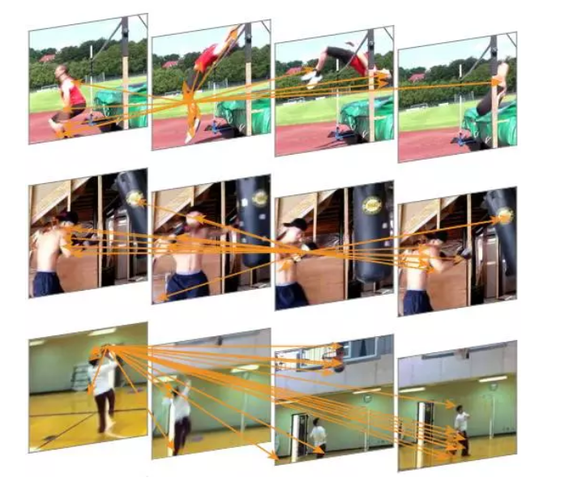
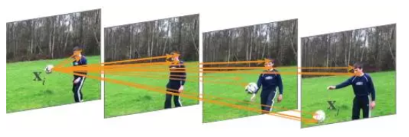
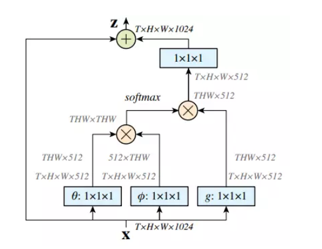
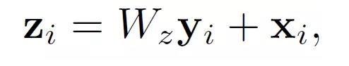
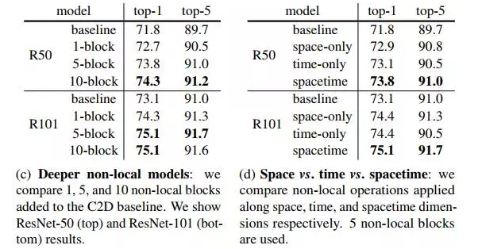
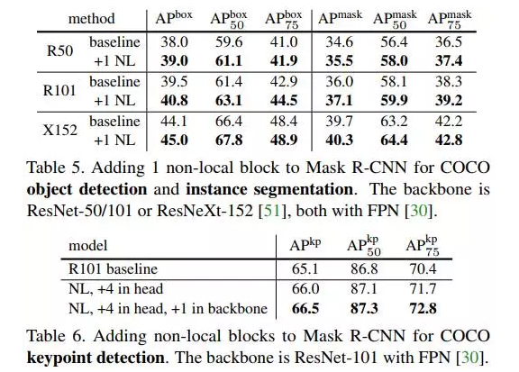
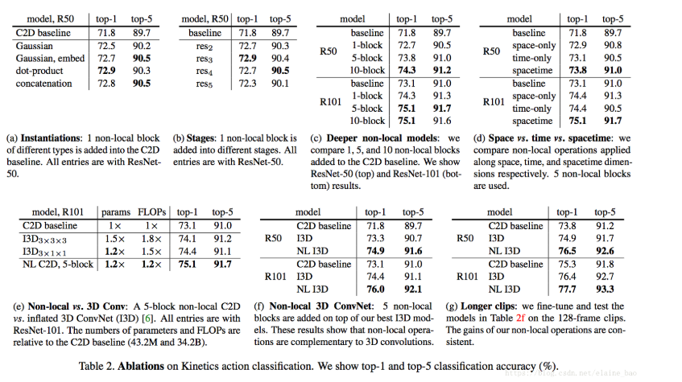

* [paper](paper/2018-Non-local%20Neural%20Networks.pdf)

## when

* CVPR 2018
* 何凯明 RGB

## what

* 提出了“非局部神经网络”。受计算机视觉中的经典非局部均值方法的启发而来，非局部网络可以作为一个简单高效的通用模块，嵌入现有视觉模型中，实验证明能够提高图像及视频分类精度，用作者的话说，在视频分类任务上，即使没有任何花里胡哨的处理，我们的非局部模型也能在 Kinetics 和 Charades 数据集上获得与一些当前视觉竞赛的冠军模型相当乃至更好的效果。
* 这篇文章除了整个故事非常完整以外，实验部分做的非常好，面面俱到地分析了各种情况，是以后写文章做实验可以学习的地方。

###  who （动机）

- 文章主要受到NL-Means在图像去噪应用中的启发，在处理序列化的任务是考虑所有的特征点来进行加权计算，克服了CNN网络过于关注局部特征的缺点。
- 图像去噪是非常基础也是非常必要的研究，去噪常常在更高级的图像处理之前进行，是图像处理的基础。图像中的噪声常常用高斯噪声N(μ,σ^2)来近似表示。 一个有效的去除高斯噪声的方式是图像求平均，对N幅相同的图像求平均的结果将使得高斯噪声的方差降低到原来的N分之一，现在效果比较好的去噪算法都是基于这一思想来进行算法设计。
- NL-Means的全称是：Non-Local Means，直译过来是**非局部平均**，在2005年由Baudes提出，该算法使用自然图像中普遍存在的冗余信息来去噪声。与常用的双线性滤波、中值滤波等利用图像局部信息来滤波不同的是，它利用了整幅图像来进行去噪，以图像块为单位在图像中寻找相似区域，再对这些区域求平均，能够比较好地去掉图像中存在的高斯噪声。
- 通常的CNN网络模拟人的认知过程，在网络的相邻两层之间使用局部连接来获取图像的局部特性，一般认为人对外界的认知是从局部到全局的，而图像的空间联系也是局部的像素联系较为紧密，而距离较远的像素相关性则较弱。因而，每个神经元其实没有必要对全局图像进行感知，只需要对局部进行感知，然后在更高层将局部的信息综合起来就得到了全局的信息。网络部分连通的思想，也是受启发于生物学里面的视觉系统结构，底层的去捕捉轮廓信息，中层的组合轮廓信息，高层的组合全局信息，最终不同的全局信息最终被综合，**但由于采样以及信息逐层传递损失了大量信息，所以传统cnn在全局信息捕捉上存在局限性**。

- 而在处理视频等序列化数据时，传统cnn的这种局限性就显得尤为严重了。比如在记录一场网球比赛的视频中，每一帧都能很容易的检测到他的手握拍在哪，一个卷积核就能覆盖位置也就是手腕周围的区域。
- 但是为了识别挥拍这个动作，仅仅关注手腕周围的信息是不够的，我们需要了解到人的手腕跟他的胳膊、肩膀、膝盖以及脚发生了哪些一系列的相对位移才能判断出挥拍动作。这些信息是将网球区别于其他运动的重要信息，因为静止来看运动员都拿着拍子站在那而已。而这些重要的全局位移信息很难被关注局部的卷积核收集到。

## where

### 创新点

* convolution和recurrent都是对局部区域进行的操作，所以它们是典型的local operations。受计算机视觉中经典的非局部均值（non-local means）的启发，本文提出一种non-local operations用于捕获长距离依（long-range dependencies），即如何建立图像上两个有一定距离的像素之间的联系，如何建立视频里两帧的联系，如何建立一段话中不同词的联系等。 
* non-local operations在计算某个位置的响应时，是考虑所有位置features的加权——所有位置可以是空间的，时间的，时空的。这个结构可以被插入到很多计算机视觉结构中，在视频分类的任务上，non-local模型在Kinetics和Charades上都达到了最好的结果。在图像识别的任务上，non-local模型提高了COCO上物体检测／物体分割／姿态估计等任务的结果。

### 优点

#### 使用非局部运算有几大好处：

（a）与递归和卷积运算的渐进的操作相比，非本局部运算直接通过计算任意两个位置之间的交互来获取长时记忆，可以不用管其间的距离；

（b）正如他们在实验中所显示的那样，非局部运算效率很高，即使只有几层（比如实验中的5层）也能达到最好的效果；

（c）最后，他们的非局部运算能够维持可变输入的大小，并且能很方便地与其他运算（比如实验中使用的卷积运算）相组合。

- “我们展示了非局部运算在视频分类应用中的有效性。在视频中，分隔开的像素在空间和时间上都会发生长时交互（long-range interaction）。我们的基本单元，也即单一的一个非局部模块，可以以前向传播的方式直接获取这些时空记忆。增加了几个非局部模块后，我们的“非局部神经网络”结构能比二维和三维卷积网络在视频分类中取得更准确的结果。另外，非局部神经网络在计算上也比三维卷积神经网络更加经济。我们在 Kinetics 和 Charades 数据集上做了全面的对比研究。我们的方法仅使用 RGB 数据，不使用任何高级处理（例如光流、多尺度测试），就取得了与这两个数据集上竞赛冠军方法相当乃至更好的结果。”

- 为了证明非局部运算的通用性，作者在 COCO 数据集上进行了物体检测、实例分割和人体姿态关键点检测的实验。**他们将非局部运算模块与 Mask R-CNN 结合，新模型在计算成本稍有增加的情况下，在所有三个任务中都取得了最高的精度。**由此表明非局部模块可以作为一种比较通用的基本组件，在设计深度神经网络时使用。

### 特点

#### 知乎讨论：将传统视觉处理里的好方法整合进入深度神经网络，值得关注

知乎用户 Dr.Frankenstein 认为**：这篇论文动机直接，但也需要一些想象力才能提出，将传统视觉处理里的好操作想法融合到深度网络里做成一个组件，延续了一直以来发paper的思路，值得关注的是实验结果。**以下内容经授权转自知乎，详见文末链接。

> Non-local mean的传统工作，这篇文章里做了简要介绍。在这里应用到CNN里面，说得暴力一点，就是在做一个网络的时候把卷积核搞的跟整张图片一样大，那为啥要这么暴力呢？  
>
>
>
> 我们要回归CNN一开始的设计思想。CNN一开始是面向目标实体识别的任务的。它就是要模拟人的认知方式，达到一个从局部到宏观的层次化认知流程。所以每一层的卷积核就不该设计的太大，底层的去捕捉轮廓信息，中层的组合轮廓信息，高层的组合全局信息。       
>
>
>
> 但对于序列化的任务，这种思路就不一定能学到充分的需要的信息。比如一个人跳水的视频，每一帧中CNN可以很好的识别他的脚在哪，一个卷积核能覆盖的位置也就是脚及其四周。而要识别跳水的动作，我们要看到他的脚跟他的膝盖、他的大腿、胳膊，发生了一系列的相对位移关系，这些信息是将跳水区别于相扑运动的重要信息，因为运动员静态地看都是只穿小裤衩而已。而这些信息难以被关注于局部的卷积核收集到。        
>
>
>
> 要注意的是，卷积核真的只关注于局部吗？如果只看一层，那答案就是“是的”。但纵观整个网络，不同的全局信息最终被综合，但由于sampling损失了大量信息，就没有这篇文章这种暴力做法来得效果明显。所以传统CNN不是很local，但是信息逐层传递丢失太多以致于不能有期待的效果。       
>
>
>
> 到这里你会发现这篇文章的想法是很简单直接的，但是有趣的其实是实验的结果：
>
> 1. 单一的non-local block加在较浅层次效果显著。Reasonable。高层次丢失的信息太多了，找不到细小的远距离的联系，太模糊了。
> 2. 多个non-local block加入，也就是加深non-local特性，有一定效果提升但不会很明显。Reasonable。既然容易起作用的是在低层加，那么使劲加深其实意义不大，加多了这种东西就要考虑梯度消失和引入噪声。毕竟你把背景全都扔进来算。
> 3. 时空同时non-local比单一时间维度或单一空间维度效果都要好。这不是废话吗。
> 4. Non-local比三维CNN要好。也是废话。这是有人会问，non-local这么吊怎么不把卷积层全都替换掉？肯定不行的！你要依赖小卷积核去捕捉主体信息，同时用他的block捕捉全局信息，两者相辅相成才有好的效果。
>
>
>
> 值得注意的是，在视频变长以后，non-local的trick的提升变小了。Reasonable。因为在时间维度上，这些短视频帧数太短，时间维度上的小卷积得到的信息不足，劣势明显。时间变长了，non-local也不能handle这么大的信息量了，损失一些信息的小卷积反而不那么差劲了。        
>
>
>
> 总结来说，insight可以的，不算很灌水。实验有些有趣的结论，但不属于极其优秀的那一类。调参是玄学，能不能有很好效果且看公布代码。

#### 知乎用户 2prime 也做了想法类似的工作，我们取得授权后将部分评论节选如下：

> 文章里面提出来attention就是nonlocal算子的特例是非常有见识的，在视频的时间一档做了一个nonlocal attention，巧妙地将kernel做成两个函数的内积，就是\phi和\theta，然后矩阵内积做出来了kernel，最后内积上提取出来的特征1x1卷积核用来降维。

非局部神经网络究竟如何？至少，作者在结论中写道，所有任务，只需简单增加一个非局部模块，就能得到稳定的性能提升。我们希望非局部神经网络能够成为未来网络结构的基本组成部分（essential component）。

- 知乎用户 Dr.Frankenstein的回答：https://www.zhihu.com/question/68473183/answer/263743198
- 知乎用户 2prime的回答：https://www.zhihu.com/question/68473183/answer/263728472
- 更多知乎讨论：https://www.zhihu.com/question/68473183

## how

### 非局部操作（Non-local operation）

* 为了处理这些全局动作信息，文章借鉴NL-Means中利用整幅图去噪的思想。前面讲到 NL-Means利用了整幅图像来进行去噪，以图像块为单位在图像中寻找相似区域，再对这些区域求平均，它的滤波过程可以用下面公式来表示：

  

在这个公式中，w(x,y)是一个权重，表示在原始图像中，像素 x和像素 y 的相似度。这个权重要大于0，同时，权重的和为1。

类似的，该文章定义了一个用于处理当前动作点与全局所有信息关系的函数

这里x是输入信号，也是和x尺寸一样的输出信号，i代表时间空间上的输出位置索引，j代表全图中所有可能位置的枚举索引。函数f(x_i, x_j)计算位置i和j的权重。函数g用来计算j位置输入信号的一个表示。文章中的Non-Local操作就是考虑了图像中的所有可能位置j。

####   文中还给出了具体的几种f(x_i,x_j)函数的实现形式

1. **Gaussian**

2. **Embedded Gaussian**

   

3. **Dot product**

**4.     Concatenation**

### 非局部模块（Non-local Block）

* 文章中还定义了Non-local Block，也就是把前面的这种Non-local操作封装起来作为一个模块可以很方便的用在现有的框架中。

  

这里y_i就是公式(1)中的输出结果。“+x_i”表示残差连接。残差连接是何恺明在他的2016年CVPR最佳论文中提出的。这个残差连接使得我们可以将这个Non-local Block很方便的插入已有的预训练模型中，而不会破坏模型原有的操作。

上图是一个Non-local Block的例子。特征图尺寸为T×H×W×1024 也就是有 1024 个通道。 f函数采用的是公式3中的Embedded Gaussian。蓝色框表示1×1×1 的卷积操作，这种结构为512通道的“瓶颈”(bottleneck)结构。

## how much

### 实验结果

视频的基线模型是 ResNet-50 C2D。三维输出映射和滤波核的尺寸用T×H×W 表示（二维核则为 H×W），后面的数字代表通道数。输入是32×224×224。方括号里的是残差模块

（c）展示了将非局部模块加入 C2D 基线后的结果，实验中用到了50层和101层的ResNet，可以看出，总体而言，增加的非局部模块越多，最后的精度越高。

（d）展示了时间、空间和时空同时非局部的效果，时空一起的效果最好。

（e）对比了非局部模块和三维卷积神经网络，增加了非局部模块（5个）的效果要好一点点。

（f）将非局部与三维卷积相结合的效果，结合了比单纯的三维卷积更好。

（g）检验了在128帧的视频中（f）中的模型的效果，发现能够保持比较稳定。

最后，下面这张图展示了将非局部模块与 Mask R-CNN 结合后，在 COCO 物体检测、实例分割以及人体关键点检测任务中性能均有所提升，使用了50和100层的ResNet，以及152层的ResNeXt。

## why （为什么好）

* **f的表现形式的影响**。表2a比较了不同的non-local block的形式插入到C2D得到的结果（插入位置在res4的最后一个residual block之前）。发现即使只加一个non-local block都能得到~1%的提高。 
  有意思的是不同的non-local block的形式效果差不多，说明是non-local block的结构在起作用，而对具体的表达方式不敏感。本文后面都采用embedded Gaussian进行实验，因为这个版本有softmax，可以直接给出[0,1]之间的scores。

* **哪个阶段加入non-local blocks？**表2b比较了一个non-local block加在resnet的不同stage的效果，具体加在不同stage的最后一个residual block之前。发现在res2，res3，res4层上加non-local block效果类似，加在res5上效果稍差。这个的可能原因是res5的spatial size比较小，只有7*7，可能无法提供精确的spatial信息了。

* **加入更多的non-local blocks。**表2c给出了加入更多non-local block的结果，我们在resnet-50上加1 block（在res4），加5 block（3个在res4，2个在res3，每隔1个residual block加1个non-local block），加10 block（在res3和res4每个residual block都加non-local block）。在resnet101的相同位置加block。发现更多non-local block通常有更好的结果。我们认为这是因为更多的non-local block能够捕获长距离多次转接的依赖。信息可以在时空域上距离较远的位置上进行来回传递，这是通过local models无法实现的。 
  另外需要提到的是增加non-local block得到的性能提升并不只是因为它给base model增加了深度。为了说明这一点，表2c中resnet50 5blocks能够达到73.8的acc，而resnet101 baseline是73.1，同时resnet50 5block只有resnet101的约70%的参数量和80%的FLOPs。说明non-local block得到的性能提升并不只是因为它增加了深度。

* **时空域上做non-local。**我们的方法也可以处理时空域的信息，这一特性非常好，在视频中相关的物体可能出现在较远的空间和较长的时间，它们的相关性也可以被我们的模型捕获。表2d给出了在时间维度，空间维度和时空维度分别做non-local的结果。仅在空间维度上做就相当于non-local的依赖仅在单帧图像内部发生，也就是说在式(1)上仅对index i的相同帧的index j做累加。仅在时间维度上做也类似。表2d显示只做时间维度或者只做空间维度的non-local，都比C2D baseline要好，但是没有同时做时空维度的效果好。

* **Non-local net vs. 3D ConvNet。**表2e比较了我们的non-local C2D版本和inflated 3D ConvNets的性能。Non-local的操作和3D conv的操作可以看成是将C2D推广到时间维度的两种方式。 
  表2e也比较了param的数量，FLOPs等。我们的non-local C2D模型比I3D更加精确（75.1 vs 74.4），并且有更小的FLOPs（1.2x vs 1.5x）。说明单独使用时non-local比3D conv更高效。

* **Non-local 3D ConvNet.** 不管上面的比较，其实non-local操作和3D conv各有各的优点：3D conv可以对局部依赖进行建模。表2f给出了在I3D3∗1∗1I3D3∗1∗1上插入5个non-local blocks的结果。发现NL I3D都能够在I3D的基础上提升1.6个点的acc，说明了non-local和3D conv是可以相互补充的。

* **更长的输入序列。** 最后我们也实验了更长输入序列的情况下模型的泛化性。输入clip包含128帧连续帧，没有做下采样，是一般情况下取的32帧的4倍长度。为了将这个模型放入显存中，每个GPU上只能放下2 clips。因为这么小的batchsize的原因，我们freeze所有的BN层。我们从32帧训练得到的模型作为初始化模型，然后用128帧进行finetune，使用相同的iterations数目（虽然batchsize减小了），初始lr为0.0025，其他设置和之前保持一致。 表2g给出了128帧的实验结果，和表2f的32帧的结果相比，所有模型都表现得更好，说明我们的模型在长序列上的效果也很好。

