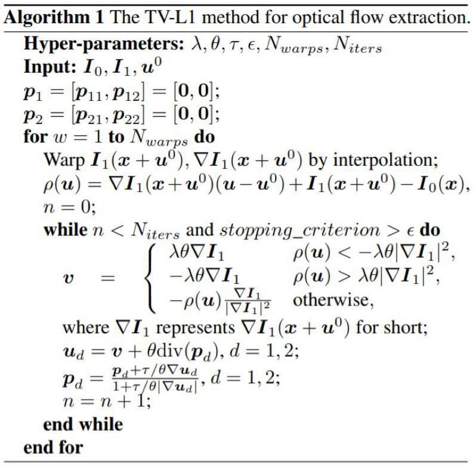
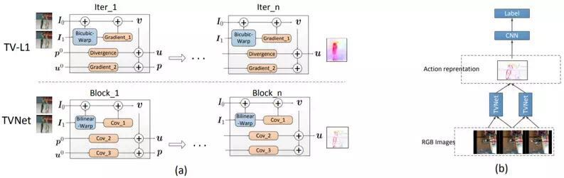
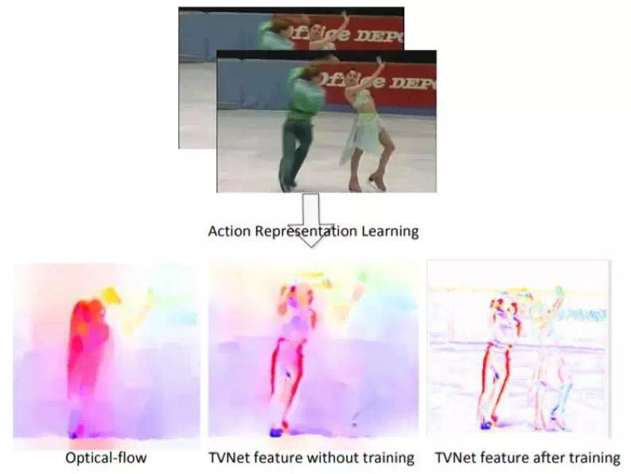
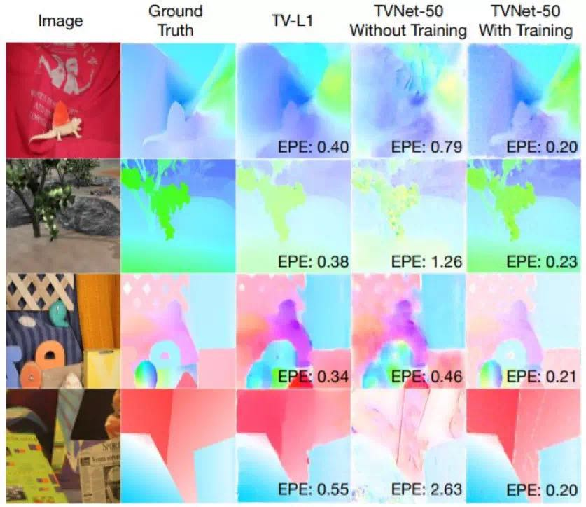
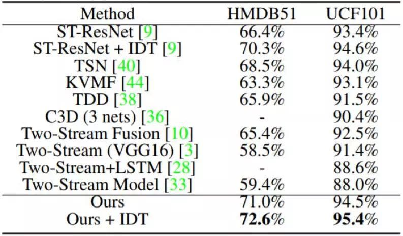

* [paper](paper/2018-End-to-End%20Learning%20of%20Motion%20Representation%20for%20Video%20Understanding.pdf)
* [CVPR 2018 | 腾讯AI Lab、MIT等机构提出TVNet：可端到端学习视频的运动表征](http://www.cvmart.net/community/article/detail/222)

### 动机

* 尽管端到端的特征学习已经取得了重要的进展，但是人工设计的光流特征仍然被广泛用于各类视频分析任务中。为了弥补这个不足而提出；

* 以前的方法：
  * 尽管已经有些研究在尝试通过在空间和时间维度上同时执行卷积运算来学习特征，但是人工设计的光流（optical flow）特征在视频分析上仍有广泛和有效的应用。
  * 光流，顾名思义，是指两个连续帧之间的像素位移。因此，将光流应用到视频理解任务上可以明确而方便地实现运动线索的建模。然而，这种方法很低效，估计光流的计算和存储成本往往很高。
  * 目前成功将光流应用于视频理解的重要方法之一是 two-stream model ，其在光流数据上训练了一个用于学习动作模式的卷积网络。研究者们已经提出了一些不同的 two-stream model 的扩展，并在动作识别和动作检测等多种任务上实现了当前最佳水平。
* 以前发方法存在的问题：
  * 训练是一种双阶段过程。第一个阶段是通过基于优化的方法（比如 TVL1）提取每两个连续帧的光流。第二个阶段是基于提取出的光流数据上训练一个 CNN。这两个阶段是分开的，而且来自第二个阶段的信息（比如梯度）无法被用于调节第一个阶段的过程。
  * 光流提取的空间和时间成本很高。提取出的光流必须写入到磁盘上，以便训练和测试。对于包含大约 1 万段视频的 UCF101 数据集而言，通过 TVL1 方法提取所有数据的光流需要消耗一个 GPU 一整天时间，而将原来的场作为浮点数来存储这些光流需要至少 1TB 的存储空间（为了节省存储成本，通常需要线性归一化成 JPEG）。
* 为了解决上述问题，我们提出了一种全新的神经网络设计，可以端到端的方式学习类光流的特征。这个名叫 TVNet 的网络是通过模仿和展开 TV-L1 的迭代优化过程而获得的。尤其值得一提的是，我们将 TV-L1 方法中的迭代形式化为了神经网络的自定义层。因此，我们的 TVNet 的设定基础良好，无需任何额外训练就能直接被使用。
* 我们的 TVNet 是可以端到端地训练的，因此可以自然地连接到特定任务的网络上（比如动作分类网络），进而实现「更深度」的可端到端训练的架构。因此，无需再预计算或存储光流特征。

### 数据集

* 我们在两个动作识别基准（HMDB51 和 UCF101）

### 创新点：

- 我们通过将 TV-L1 方法的迭代展开成自定义的神经层，开发了一种学习视频中的运动的全新神经网络。这个网络名叫 TVNet，具有良好的初始化。
- 尽管我们提出的 TVNet 是以特定的 TV-L1 架构初始化的，但相比于标准的光流，它可以在进一步微调之后学习到更丰富和更面向任务的特征。
- 相比于其它动作表征学习的方法（比如 TV-L1、FlowNet2.0 和 3D Convnets），我们的 TVNet 在两个动作识别基准上实现了更优的准确度，即在 HMDB51 上实现了 72.6% 的准确度、在 UCF101 上实现了 95.4% 的准确度。

### 方法

* 算法 1：用于光流提取的 TV-L1 方法

* 将 TV-L1 展开成 TVNet 的过程示意图。对于 TV-L1，我们只描述了算法 1 中的单次迭代。我们将 TV-L1 中的双三次翘曲（bicubic warping）、梯度和散度计算重新形式化为了 TVNet 中的双线性翘曲（bilinear warping）和卷积运算。（b）用于动作识别的端到端模型。

  

### 实验效果

* 由 TV-L1、TVNet（无训练）、TVNet（有训练）得到的类光流运动特征的可视化结果

* TV-L1 和 TVNet-50 在 MiddleBurry 上估计得到的光流示例。经过训练后，TVNet-50 可以提取出比 TV-L1 更精细的特征。

* 在 HMDB51 和 UCF101 上的平均分类准确度

